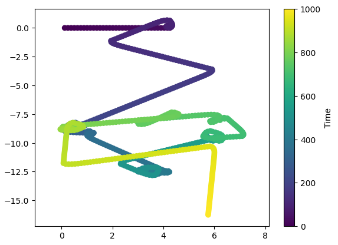
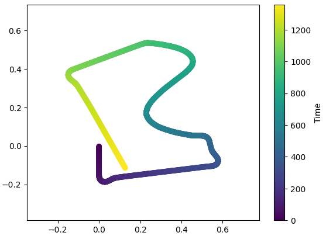

# Line Following Robot with Odometry

A line-following robot implementation using the ePuck robot platform in Webots simulator, featuring proportional control and odometry tracking.

## Project Structure
```
Lab 2/
├── README.md
├── worlds/                # Webots world files
├── controllers/           
│   └── lab2_controller/   # Robot controller implementation
├── exploring_data.ipynb   # Trajectory analysis notebook
└── ...                    # misc files
```

## Components

### Controller
- Line following behavior using three ground sensors
- Proportional control with speed ramping
- Odometry tracking with midpoint integration
- Corner speed adjustments and recovery behavior
- Start/finish line detection for loop closure

### Analysis Tools
Visualization tools for robot trajectory:
- Reads position data from output files
- Plots trajectory with temporal color gradient
- 90-degree rotation for proper visualization

## Implementation Results

### Initial Implementation


### Improved Implementation


## Robot Configuration
- Platform: ePuck robot
- Wheel separation: 53mm
- Max wheel speed: ~0.126 m/s
- Ground sensors: 3 (left, center, right)
- Ground sensor threshold: 500

## Features

### Line Following
- Adaptive turning using proportional control
- Speed ramping for smooth transitions
- Corner detection and speed adjustment
- Recovery behavior when line is lost

### Odometry
- Uses midpoint integration
- Tracks pose (x, y, theta) in world coordinates
- Updates based on wheel velocities
- Resets at loop closure points

## Usage
1. Open the Webots world file
2. The controller will automatically:
   - Follow the line while tracking position
   - Reset odometry at loop closures
3. Use the Jupyter notebook to analyze recorded trajectories